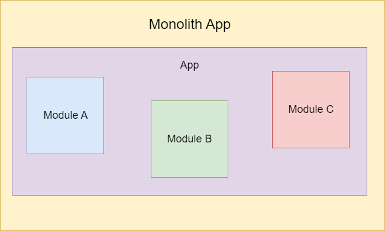

# AngularMicrofrontendApp

This project was generated with [Angular CLI](https://github.com/angular/angular-cli) version 13.2.4.

The application was developed using micro frontend architecture that provides a distributed application development approach through multiple teams working together and in parallel.

## Features

### The technologies used in this project are explained below

**concurrently**: is a technology to allow run multiple line commands concurrently. It is used to run build and start proccesses from the app.
**live-server**: is a little development server that allow serve static files. It is used to simulate deployment environment from the micro apps and get its required static files.
**ngx-build-plus**: is a technology to extend te Angular CLI's default build behvaior. It is used to build a single bundle for each app.

### What is micro frontends ?

In the past, we made monolith applications and it worked fine for a while, but as your application grows, the effort to change the code and implement new features grows along with it, the deployment time gets slower and there are more conflicts in the branches because of the resources developed by different teams.

In the same way we have micro services to split the backend in multiple apps, we also have a similar approach on the frontend. Micro frontend is an technique for developing small applications to facilitate software development.

The purpose of micro frontend architecture is to divide applications into small apps, developed and managed by specific teams for several reasons such as reducing deployment time, reducing development complexity and working with any technology stack, basically, the team becomes owner of the features developed and have a great decision-making power.

### How the micro frontend architecture works

This project runs three apps in parallel, all these applications are transformed into web components to work together regardless of technology, it is possible to develop apps with different frameworks and put all of them to work together without problems because all the implementation complexity is encapsulated in web components.

The app **angular-microfrontend-app** is the base app, it is platform, the goal this app is to provide an environment to render other apps and define the navigation strategy. In this case, navigation occurs when HTML anchors prefixed with hash(#) are clicked, this click defines the path in the browser and this path must be equal to some route configured in some app.

The apps **renda-fixa** and **renda-variavel** are standalone apps that contains different features and business rules, each of which would be developed for different teams within a real case.

## Preview

## Build

You can build apps separately, just run `npm run build` to build the main project. After that you should run `npm run build:rendafixa` and `npm run build:rendavariavel` to build the micro apps. The build artifacts will be stored in the `dist/` directory.

## Usage

Run `npm start` to execute the app. This command will build all applications, start the live server to serve the dist folder static files and start the application. Navigate to `http://localhost:4200/` to access the app.
